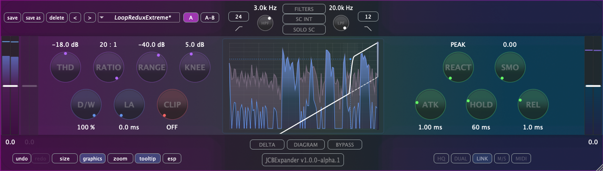
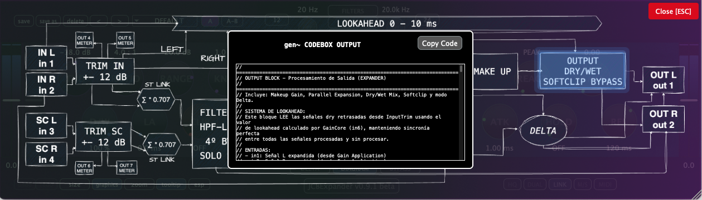

Plugin expansor de audio desarrollado en gen~, exportado con [gen~ Plugin Export](https://github.com/Cycling74/gen-plugin-export) y finalizado con el framework C++ [JUCE](https://github.com/juce-framework/JUCE). Este plugin forma parte de un conjunto de herramientas didácticas que utilizo en la asignatura de Técnicas de Grabación y Masterización para Música Electroacústica del [MCE](https://katarinagurska.com/curso-of/master-de-composicion-electroacustica-mce/). Originalmente creado con JUCE 6 hace unos años, el proyecto ha evolucionado significativamente en su interfaz y funcionalidad gracias al desarrollo con Claude Code durante junio de 2025. Para más detalles técnicos, consulta [NOTAS.md](NOTAS.md).

## Instalación macOS
1. Descarga el archivo DMG desde la página de [Releases](https://github.com/cjitter/JCBExpander/releases)
2. Abre el DMG y ejecuta el instalador
3. El instalador colocará automáticamente los tipos de plugins seleccionados en las ubicaciones correctas del sistema:
   - VST3: `/Library/Audio/Plug-Ins/VST3/`
   - AU: `/Library/Audio/Plug-Ins/Components/`
   - AAX: `/Library/Application Support/Avid/Audio/Plug-Ins/`

*Nota: El DMG está firmado y notarizado para macOS.*

## Requisitos del sistema

- macOS 10.12 o posterior
- Procesador Intel o Apple Silicon
- DAW compatible con VST3, AU o AAX
- Probado en: Pro Tools, Reaper, Logic, Ableton Live y Bitwig

## Compilación desde código fuente

### Requisitos previos
- Git, [CMake](https://cmake.org) 3.20 o posterior y compilador Apple Clang compatible con C++20 (incluido en Xcode 13 o superior).
- [JUCE](https://github.com/juce-framework/JUCE) 8.0.8 (se descarga automáticamente vía FetchContent).
- **AAX SDK**, requerido solo para compilar formato AAX (disponible para cuentas de desarrollador Avid).

### Instrucciones de compilación

1. Clona el repositorio:
```bash
git clone https://github.com/cjitter/JCBExpander.git
cd JCBExpander
```

2. **Configuración del proyecto**:
```bash
# Configurar proyecto Debug (VST3 y AU)
cmake -B build-debug -DCMAKE_BUILD_TYPE=Debug

# Configurar proyecto Release (VST3 y AU)
cmake -B build-release -DCMAKE_BUILD_TYPE=Release

# Configurar proyecto con AAX (requiere AAX SDK y Pro Tools Developer instalado)
cmake -B build-debug -DCMAKE_BUILD_TYPE=Debug -DJUCE_BUILD_AAX=ON
```

**Nota sobre generadores**: Por defecto, CMake usa Unix Makefiles en macOS, pero puedes especificar otros:
- **Ninja** (más rápido): `cmake -B build -G Ninja`
- **Xcode** (IDE nativo): `cmake -B build -G Xcode`

**Nota sobre AAX**: Si habilitas AAX, al compilar el plugin se instalará automáticamente en `/Applications/Pro Tools Developer/Plug-Ins/` para pruebas con Pro Tools Developer.

3. **Compilación**:
```bash
# Compilar el proyecto configurado
cmake --build build-debug     # Para Debug
cmake --build build-release   # Para Release
```

## Características principales

- **Expansor de rango dinámico** con controles independientes de threshold, ratio, range, knee, attack, hold y release.
- **Trim y makeup** ±12 dB para ajustar nivel de entrada y salida.
- **Sidechain interno y externo** con HPF/LPF variables (20 Hz – 20 kHz) y filtros suaves.
- **Modo lookahead** de 0 a 10 ms con compensación de latencia transparente.
- **Softknee ajustable** (1–10 dB) para transiciones suaves entre señal seca y expandida.
- **Modo Delta** para preescuchar únicamente la diferencia entre señal original y procesada.
- **Softclip asimétrico** en la salida para controlar picos posteriores a la expansión.
- **Mezcla Dry/Wet** continua de 0 a 100% para expansión paralela.
- **Procesamiento mono y estéreo** con detección compartida y sincronizada.
- **Medidores en tiempo real** de entrada, salida y reducción de ganancia, además del diagrama de bloques interactivo.
- **Gestión de presets** de fábrica y usuario con guardado de estados de UI.
- **Bypass interno** con transición suave y sincronización con el bypass del host.



## Recursos

### Bibliografía técnica
- [Graham Wakefield & Gregory Taylor - *Generating Sound and Organizing Time*](https://cycling74.com/books/go)
- [Will C. Pirkle - *Designing Audio Effect Plugins in C++*](https://www.willpirkle.com)
- [Giannoulis, Massberg, Reiss - *Dynamic Range Compressor Design*](https://eecs.qmul.ac.uk/~josh/documents/2012/GiannoulisMassbergReiss-dynamicrangecompression-JAES2012.pdf)
- [Matthijs Hollemans - *The Complete Beginner's Guide to Audio Plug-in Development*](https://www.theaudioprogrammer.com/books/beginners-plugin-book)

## Por hacer

- Migrar de Plugin Export a la exportación C++ de RNBO.
- Implementar oversampling con el módulo DSP de JUCE.
- Añadir modos dual y M/S.
- Integrar mapeo MIDI.
- Portar a SuperCollider los bloques de GenExpr o crear un UGen dedicado.

---

*© 2025 Juan Carlos Blancas – JCBExpander v1.0.1*
